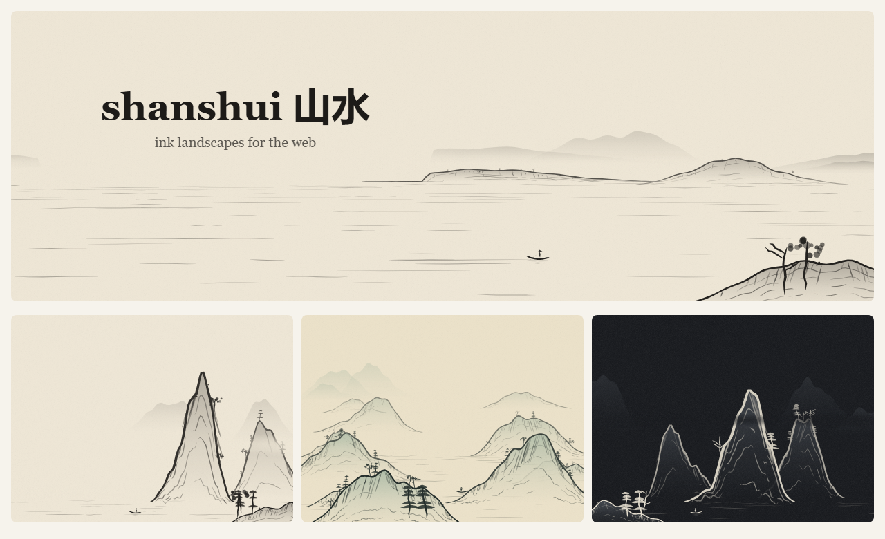

# shanshui 山水

**Procedurally generated Chinese ink landscapes for your website.**
Hero backgrounds, headers and post covers, each one a unique painting from a seed.



## Why

Traditional *shan shui* (山水, "mountain-water") painting has ideas that fit web design well:

- **留白 (liú bái), "leaving white":** painters kept empty space on purpose. shanshui does the same for your headline. Say where your text goes, and the mountains move aside.
- **三远 (sān yuǎn), the three distances:** Guo Xi's 11th-century theory of composition. It gives three distinct layouts: a wide *level* view across water, a towering *high* peak, and a *deep* valley of receding ranges.
- **Brushwork:** ridge lines, texture strokes (皴) and moss dots are drawn as ink strokes, and they can paint themselves in when the page loads.

Give it a seed, such as a page slug or a post title, and you get the same painting every time.

## Features

- **Seeded:** the same seed always gives the same painting
- **Space for your content:** `left`, `right`, `center`, `top`, or any box
- **Three compositions:** level 平远, high 高远 and deep 深远
- **Animation:** a brush-stroke reveal, drifting mist and a drifting boat. Respects `prefers-reduced-motion`.
- **Palettes:** ink, blue-green, night, mist, or your brand colours via CSS variables
- **Fits any shape:** banner, card or phone, and redraws on resize
- **Tiny:** about 8 KB gzipped, no dependencies, pure SVG
- **Use it anywhere:** a web component, a JS API, a CDN script tag, or server-side rendering

## Quick start

With no build step:

```html
<script src="https://cdn.jsdelivr.net/npm/shanshui@0.1/dist/shanshui.iife.js"></script>

<shan-shui seed="welcome" space="left" animate style="aspect-ratio: 16 / 7">
  <h1>Your headline</h1>
</shan-shui>
```

With npm:

```sh
npm install shanshui
```

```js
import 'shanshui/element'                    // registers <shan-shui>
import { createLandscape } from 'shanshui'   // or use the JS API

createLandscape('#hero', { seed: 'my-post', distance: 'high', space: 'left', animate: true })
```

**Full documentation: [packages/core/README.md](packages/core/README.md)**

## Try it locally

```sh
git clone https://github.com/barada02/Mordern_Web_Art.git
cd Mordern_Web_Art
npm install
npm run dev
```

This opens a playground where you can change seeds, compositions, palettes and animation, and see the web component demos.

## Project structure

```
packages/core      the `shanshui` library, published to npm
apps/playground    demo app that uses the library the way you would
```

## Credits

Inspired by Lingdong Huang's beautiful [{Shan, Shui}\*](https://github.com/LingDong-/shan-shui-inf), an infinite procedural shan shui painting. shanshui is an independent implementation with a different goal: making paintings *for* your site.

## License

[MIT](LICENSE)

dummy